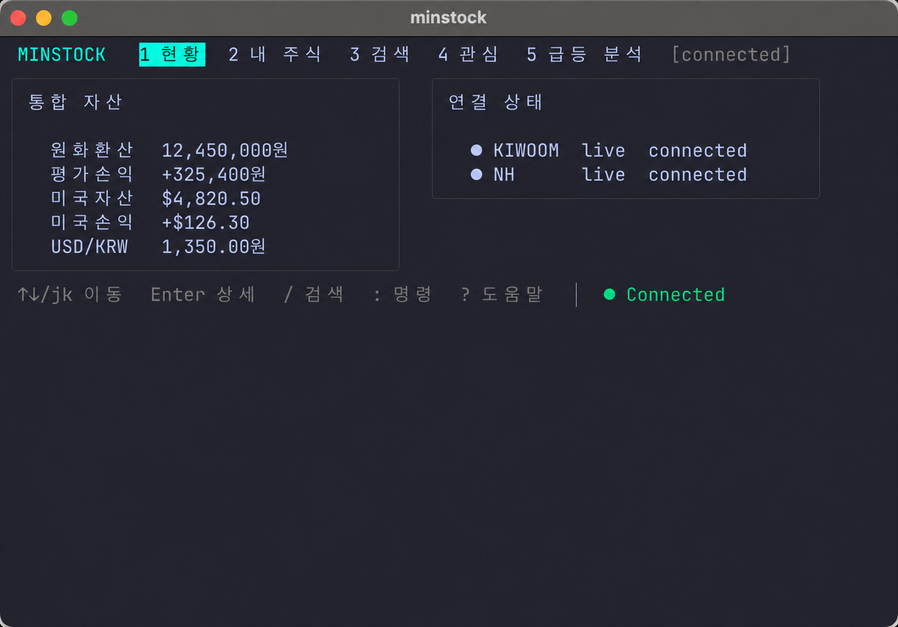
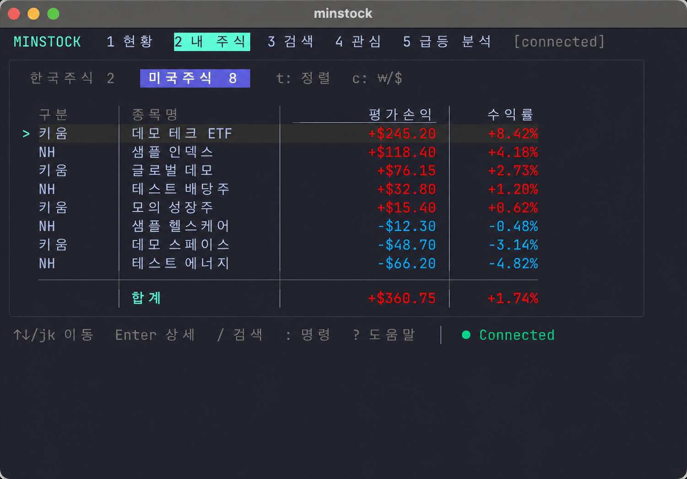
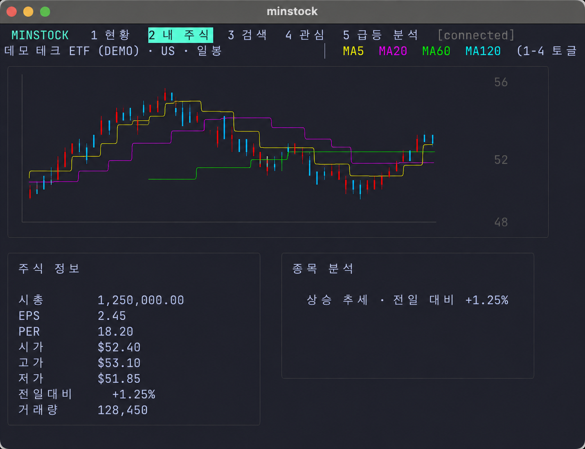
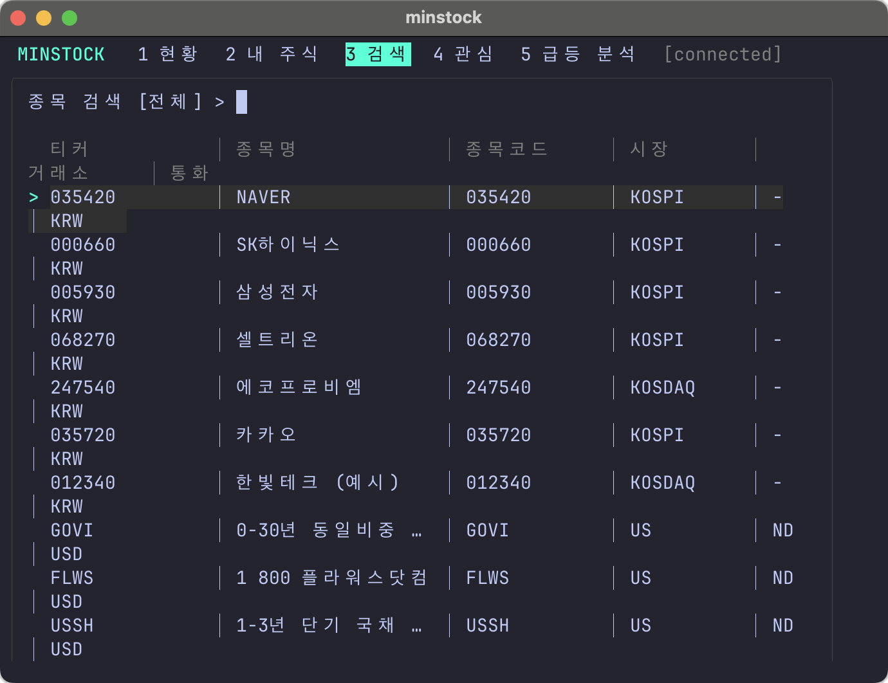
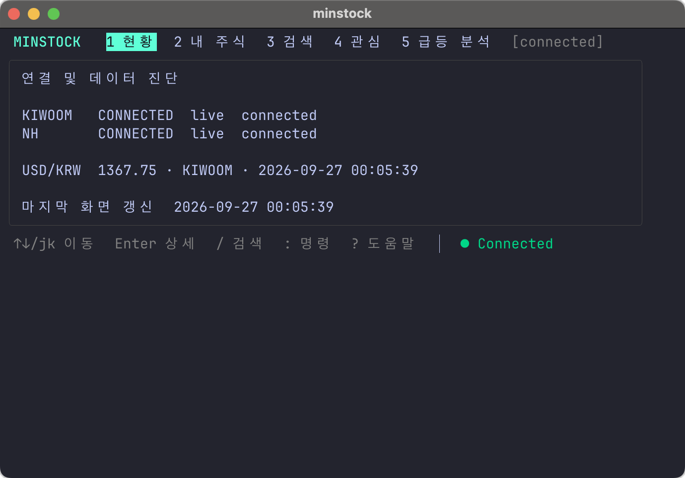
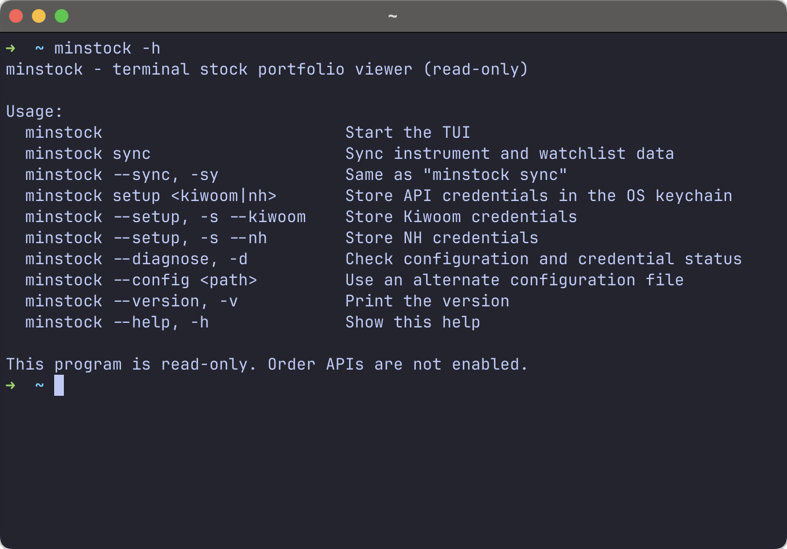

# minstock

NH투자증권(NAMUH PLUG)과 키움증권 OpenAPI에 흩어진 국내·미국주식 자산을 하나의
터미널에서 조회하는 Go 기반 포트폴리오 TUI입니다. 증권사별로 다른 계좌·시세 응답을
공통 도메인으로 통합하고, 터미널 환경에서도 검색·차트·관심종목·수익 분석을 빠르게
탐색할 수 있도록 구현했습니다.

실계좌를 다루는 프로그램인 만큼 주문 기능은 의도적으로 제외했습니다. API 키가 없어도
내장 데모 데이터로 전체 화면과 조작 방식을 확인할 수 있습니다.

> 급등 분석은 정량 조건을 설명하는 관찰 도구이며 투자 추천이 아닙니다.

## 프로젝트 소개

여러 증권사를 사용하면 보유 종목과 손익을 각각의 앱에서 확인해야 하고, 국내주식과
미국주식의 통화·시장·종목 식별 체계도 서로 다릅니다. minstock은 이 데이터를 공통
모델로 정규화하여 한 화면에서 비교하고, 조회부터 차트 탐색까지 키보드만으로 이어지는
개인 투자 현황 조회 환경을 만드는 것을 목표로 했습니다.

| 구분 | 내용 |
|---|---|
| 개발 범위 | CLI, TUI, 증권사 REST/OAuth 어댑터, 로컬 저장소, 테스트와 운영 문서 |
| 핵심 가치 | 다중 증권사 자산 통합, 빠른 첫 화면, 조회 전용 안전성, 키보드 중심 UX |
| 지원 시장 | 한국주식, 미국주식, KRW·USD 자산 |
| 안전 경계 | 주문 API 미구현, 조회 경로 allowlist, 자격증명 OS 키링 보관 |
| 실행 모드 | 실제 API 연결, 모의 서버, 자격증명 없는 데모 모드 |

## 화면 미리보기

주요 화면에서 통합 자산 조회부터 종목 탐색과 연결 진단까지 확인할 수 있습니다.

<table>
  <tr>
    <td align="center" width="50%">
      <br>
      <sub><strong>통합 현황</strong> — 증권사 연결 상태와 원화·외화 자산 요약</sub>
    </td>
    <td align="center" width="50%">
      <br>
      <sub><strong>내 주식</strong> — 한국·미국 종목별 손익과 수익률</sub>
    </td>
  </tr>
  <tr>
    <td align="center" width="50%">
      <br>
      <sub><strong>상세 차트</strong> — 캔들과 MA5·20·60·120 분석</sub>
    </td>
    <td align="center" width="50%">
      <br>
      <sub><strong>종목 검색</strong> — 티커·종목명·종목코드 로컬 검색</sub>
    </td>
  </tr>
  <tr>
    <td align="center" width="50%">
      <br>
      <sub><strong>연결 진단</strong> — 공급자별 연결 상태와 데이터 기준 시각</sub>
    </td>
    <td align="center" width="50%">
      <br>
      <sub><strong>CLI 도움말</strong> — 실행·동기화·설정·진단 명령 안내</sub>
    </td>
  </tr>
</table>

> 위 캡처에 표시된 종목·금액·수익률은 가상투자 시뮬레이션을 위해 구성한 합성 샘플
> 데이터이며, 실제 계좌나 투자 성과를 나타내지 않습니다.

<!---
캡처 갱신 방법과 개인정보 확인 항목은
[스크린샷 가이드](docs/images/README.md)에 정리했습니다.
--->
## 기술 스택

| 영역 | 기술 | 선택 이유 |
|---|---|---|
| Language | Go 1.27 | 단일 바이너리 배포, 고루틴 기반 비동기 조회, 명확한 인터페이스 |
| TUI | Bubble Tea v2 | Elm 스타일 상태 모델과 예측 가능한 이벤트 처리 |
| Styling | Lip Gloss v2 | ANSI 색상과 터미널 폭을 고려한 레이아웃 구성 |
| Chart | ntcharts v2 | 터미널 캔들·시계열 차트 렌더링 |
| Database | modernc.org/sqlite | CGO 없이 종목 인덱스·관심종목·캔들·스냅샷 영속화 |
| Numeric | shopspring/decimal | 금액과 수익률 계산에서 부동소수점 오차 방지 |
| Security | go-keyring | macOS Keychain/Linux Secret Service에 API 자격증명과 토큰 저장 |
| External API | Kiwoom REST API, NH NAMUH PLUG | 계좌·잔고·시세·종목·캔들 조회 |
| Quality | Go test, httptest, go vet | 도메인 계산, API 계약, 저장소와 TUI 회귀 검증 |

## 주요 구현 내용

### 증권사별 데이터를 공통 도메인으로 통합

키움과 NH의 서로 다른 계좌·잔고·포지션 응답을 `Account`, `Balance`, `Position`,
`Symbol`, `Candle` 모델로 변환했습니다. TUI와 애플리케이션 서비스는 증권사 응답
필드에 의존하지 않고 포트 인터페이스만 사용하므로, 공급자별 변경을 어댑터 내부로
격리하고 새로운 증권사를 같은 방식으로 확장할 수 있습니다.

### 캐시 우선·점진적 갱신

프로그램 시작 시 `SQLite 스냅샷 → 최신 계좌·환율 → 종목별 시세·분석` 순서로 데이터를
표시합니다. 마지막 정상 화면을 즉시 복원한 뒤 핵심 계좌 데이터와 부가 시세를 단계적으로
교체해 네트워크 호출이 끝날 때까지 빈 화면에서 기다리지 않도록 했습니다. 종목 검색은
로컬 인덱스를 사용해 입력마다 외부 API를 호출하지 않습니다.

### 기록 기반 성과와 증권사별 자산 분석

계좌 조회가 완료될 때마다 증권사·계좌·통화별 원통화 금액과 원화 환산 금액을 하루 한
행으로 SQLite에 갱신합니다. 성과 화면은 이를 날짜별로 합산해 총자산, 평가손익, 전 기록
대비 자산 증감과 증감률을 보여줍니다. `Tab`으로 표와 선 그래프를 전환하고 그래프에서
`t`를 누르면 일간·주간·월간·연간의 각 기간 마지막 자산으로 집계합니다.

통합 현황은 같은 정규화 결과를 키움과 NH로 다시 나눠 총자산, 평가손익, 수익률,
미국자산, 적용환율과 전체 자산 비중을 표시합니다. 한 증권사가 연결되지 않아도 다른
증권사의 데이터는 독립적으로 계산하며, 미연결 행은 `데이터 없음`으로 구분합니다.

### 데이터 출처와 갱신 상태

금액이 최신 API 응답인지, 짧은 공유 캐시나 장애 시 마지막 정상값인지 화면에서 구분할
수 있도록 잔고와 포지션에 신선도와 기준 시각을 전달합니다. 좁은 화면에서는 `●` 실시간,
`◐` 혼합, `○` 캐시로 표시하고 USD/KRW에는 `[NH·●]`처럼 환율 제공 증권사도 붙입니다.
넓은 화면의 증권사별 표에서는 상태와 기준 시각을 함께 확인할 수 있습니다.

### 조회 전용 안전 경계와 자격증명 보호

주문 포트를 실행 경로에 두지 않았고, 키움 API는 허용한 조회 API ID와 경로의 조합만
요청할 수 있습니다. App Key와 Secret은 설정 파일이나 SQLite가 아닌 OS 키링에 저장하며,
토큰·계좌번호·비밀값은 진단 출력에 포함하지 않습니다. NH 토큰은 만료 시각과 함께
캐시하여 재실행 때 불필요한 재발급과 보안 알림을 줄였습니다.

### 터미널에 맞춘 자산 탐색 UX

Bubble Tea의 단방향 상태 흐름 위에 Vim 스타일 이동, 콜론 명령, 검색 입력 모드,
한국/미국 탭과 시장 필터를 구성했습니다. 한글 표시 폭과 ANSI 색상 코드를 분리해 표를
정렬하고, 좁은 터미널에서는 12개 자산 열을 구간별로 이동할 수 있게 했습니다. 상세
화면에서는 봉 단위와 이동평균선을 키보드로 즉시 전환할 수 있습니다.

### 설명 가능한 규칙 기반 분석

변화율, 단기 상승률, 거래량 비율, 거래대금, 고점 거리와 체결강도를 점수와 근거로
표시합니다. 결과만 보여주는 대신 어떤 조건이 충족됐는지 함께 제시하고, 이동평균·봉 집계·
점수 계산을 순수 도메인 로직으로 분리해 단위 테스트할 수 있도록 했습니다.

## 제공 기능

- NH·키움 국내·미국주식 계좌의 잔고·보유 종목 통합 조회
- 증권사별 총자산·평가손익·수익률·미국자산·적용환율·자산비중 현황
- 내 주식의 한국/미국 탭, 12개 자산 열 표와 USD·원화 환산 표시
- 티커·종목코드·한글/영문 종목명 및 미국주식 전체 종목 로컬 검색
- OHLC 캔들 차트와 MA5·MA20·MA60·MA120 이동평균선
- 종목 상세 화면(상단 전체 폭 차트·하단 주식정보·규칙 기반 분석)
- 종목별 뉴스·공시: 국내 NAVER 뉴스/DART 공시, 미국 Alpha Vantage 뉴스와 원문 링크
- 틱, 1·5·15·60분, 일, 주, 월, 년 차트 전환
- 키움 국내·미국 관심종목과 minstock 로컬 관심종목 통합 조회
- 시장 전체 순위 API와 최신 분봉으로 계산하는 국내 급등 후보 분석
- 일별 총자산·평가손익과 전 기록 대비 증감, 일·주·월·연 선 그래프를 제공하는 성과 화면
- 실시간·혼합·캐시 상태, 데이터 기준 시각과 USD/KRW 제공 증권사 표시
- 미국주식·ETF 최근 배당, 연간 세전·세후 예상액, 원화 환산과 월별 예상 캘린더
- TUI에서 저장하는 통합·증권사별 목표 비중과 현재 편차·집중도 분석
- 목표가·일간 변동률·보유 손실률·자산 비중·연결 실패의 로컬 알림 이력과 확인 상태
- 키움 미국주식 잔고·외화예수금·현재가·차트와 USD/KRW 기준환율
- OAuth 토큰 자동 갱신, 요청 제한, SQLite 캔들·대시보드 캐시
- 상세 화면 숫자키 `1`~`4`로 MA5·MA20·MA60·MA120 개별 표시 전환
- API 키가 없을 때 자동 demo 모드

## 빠른 시작

Go 1.27 이상이 필요합니다.

```sh
git clone https://github.com/77romin/minstock-tui.git
cd minstock-tui
make build
./bin/minstock
```

시스템 어디서나 `minstock`으로 실행하려면 다음처럼 설치합니다.

```sh
make install
```

`$(go env GOPATH)/bin`이 `PATH`에 포함되어 있어야 합니다. zsh에서는 필요할 경우
`~/.zshrc`에 아래 줄을 추가한 뒤 새 터미널을 여십시오.

```sh
export PATH="$(go env GOPATH)/bin:$PATH"
```

이후 실행 명령은 간단히 `minstock`입니다.

## 명령과 옵션

TUI 안에서 대부분의 작업을 하므로 옵션은 운영에 필요한 최소 범위만 제공합니다.

| 명령 | 설명 |
|---|---|
| `minstock` | TUI 실행 |
| `minstock --sync`, `minstock -sy` | 종목 인덱스와 지원되는 증권사 관심종목 동기화 |
| `minstock setup kiwoom` | 키움 App Key/Secret을 OS 키링에 저장 |
| `minstock setup nh` | NH App Key/Secret을 OS 키링에 저장 |
| `minstock setup naver` | 국내 뉴스 Client ID/Secret을 OS 키링에 저장 |
| `minstock setup dart` | 국내 공시 API 키를 OS 키링에 저장 |
| `minstock --setup --kiwoom`, `minstock -s --kiwoom` | 키움 키체인 등록 |
| `minstock --setup --nh`, `minstock -s --nh` | NH 키체인 등록 |
| `minstock --setup --naver`, `minstock -s --naver` | NAVER API HUB Client ID/Secret 키체인 등록 |
| `minstock --setup --dart`, `minstock -s --dart` | DART 공시 API 키체인 등록 |
| `minstock --diagnose` | 설정 경로, DB 경로, 자격증명 준비 상태 확인 |
| `minstock -d` | `--diagnose`와 동일 |
| `minstock --version` | 버전 출력 |
| `minstock -v` | `--version`과 동일 |
| `minstock --config ./my.toml` | 지정한 설정 파일로 TUI 실행 |
| `minstock help` | CLI 사용법 출력 |

전역 옵션은 하위 명령보다 앞에 둡니다. 예: `minstock --config ./my.toml sync`.

`--broker`, `--symbol`, `--interval` 같은 조회 옵션은 만들지 않았습니다. 대화형 TUI에서
필터와 종목·차트 단위를 바꾸는 편이 더 빠르고, CLI는 설정·진단·동기화처럼 자동화에
유용한 기능만 담당합니다.

## TUI 사용법

| 키 | 동작 |
|---|---|
| `1`~`9` | 현황, 내 주식, 검색, 관심종목, 급등 분석, 성과, 배당, 목표 비중, 알림 이동 |
| 배당 화면 `Tab` | 종목별 예상액과 향후 12개월 월별 캘린더 전환 |
| 목표 비중 화면 `Tab` | 통합, NH, 키움 분석 범위 전환 |
| 목표 비중 화면 `Enter`/`e` | 선택 종목 또는 현금의 목표 비중 편집 |
| 목표 비중 화면 `a`/`d` | 미보유 종목 검색·추가 / 선택 목표를 0%로 변경 |
| 목표 비중 화면 `r`/`s`/`u` | 현재 비중을 합계 100%로 복사 / 저장 / 미저장 편집 되돌리기 |
| 알림 화면 `Tab` | 알림 이력과 목표가 규칙 전환 |
| 알림 규칙 화면 `a`/`d` | `티커 목표가` 형식으로 목표가 추가·갱신 / 선택 규칙 삭제 |
| 알림 이력 화면 `x`/`X` | 선택 알림 확인 / 모든 알림 확인 |
| `←`/`→`, `h`/`l` | 이전·다음 기본 화면 이동 |
| `↑`/`↓`, `j`/`k` | 행 선택 |
| `Enter` | 선택 종목 상세 차트 |
| `/` | 종목 검색 |
| 상세 화면 `←`/`→`, `h`/`l` | 틱 → 분 → 일 → 주 → 월 → 년 단위 전환 |
| 상세 화면 `1`~`4` | MA5·MA20·MA60·MA120 개별 표시 전환 |
| `gg`, `G` | 목록의 처음, 끝으로 이동 |
| `Ctrl+u`, `Ctrl+d` | 반 페이지 위, 아래로 이동 |
| `gt`, `gT` | 다음, 이전 화면 탭 |
| `m` | 선택 종목의 로컬 관심종목 추가/해제 |
| 내 주식 `Tab`/`Shift+Tab` | 한국주식·미국주식 탭 전환 |
| 내 주식 `[`/`]` | 좁은 터미널에서 표의 이전·다음 열 구간 보기 |
| 성과 화면 `Tab` | 일별 성과 표 ↔ 총자산 선 그래프 전환 |
| 성과 그래프 `t` | 일간 → 주간 → 월간 → 연간 주기 전환 |
| `f` | 내 주식 탭 전환, 그 외 화면은 전체 → 한국 → 미국 시장 필터 |
| `c` | 원통화($/₩) ↔ 원화(₩) 표시 전환 |
| `t` | 내 주식 정렬: 기본 순서 → 수익률 → 보유비중 |
| `Esc` | 이전 화면 또는 입력/명령 취소 |
| `Ctrl+C` | 비상 종료 |

목표 비중을 편집하거나 종목을 추가하면 화면에 `편집 중`이 표시됩니다. 이 상태에서는
5초 계좌 갱신이 미저장 목표를 덮어쓰지 않으며, 범위 전환도 저장 또는 되돌리기 전까지
차단됩니다. `r`은 행별 반올림 뒤 가장 큰 비중에 반올림 오차를 보정해 합계를 정확히
`100.00%`로 만듭니다.

알림 화면의 기본 조건은 일간 변동률 절댓값 5% 이상, 보유 손실률 -10% 이하, 단일 종목
자산 비중 30% 이상, API 연결 실패 3회 연속입니다. 같은 조건은 하루 한 번만 이력에
저장합니다. 목표가 입력 예시는 `VOO 700`이며 현재가보다 높은 목표는 이상 도달, 낮은
목표는 이하 도달 조건으로 저장됩니다.

### 시장 급등 스캐너

`5 급등` 화면에 들어가면 키움의 등락률 상위(`ka10027`), 거래량 급증(`ka10023`),
거래대금 상위(`ka10032`)를 조회합니다. 보유·관심종목과 관계없이 시장 전체의 상위
후보를 수집하며, KRX 정규장 기준으로 분석합니다. 각 순위는 최대 3페이지,
상세 분석은 기본 20종목으로 제한하고 조회 한도가 적용되면 화면에 표시합니다.
ETF/ETN 제외가 켜져 있으면 거래대금 순위는 필터를 통과한 등락률·거래량 후보를
보강하는 데 사용합니다. 순위 API 일부가 실패하면 불완전한 조회임을 함께 표시합니다.

최근 완료된 1분봉으로 5분 등락률을 계산하고, 거래량 배수는 **최근 완료 5분의
거래량 합 / 직전 5분의 거래량 합**입니다. 전일 동시간 대비 지표가 아닙니다.
순위 거래대금은 키움의 백만원 단위를 원화로 변환합니다. 상세 분석은 종목별
체결정보(`ka10003`)의 원화 누적거래대금과 체결강도를 우선 사용하므로 거래대금
상위 목록에 없는 후보도 평가합니다. 고점 거리와 체결강도도
함께 표시하며, 체결강도 미제공 시 해당 점수는 0점으로 표시합니다.
미완료 봉, 시간 간격 누락, 정규장 경계, 3분 초과 지연, 기준 거래량 0인 종목은
계산하지 않고 `데이터 부족` 집계에 포함합니다. 장 초반에는 완료 봉 11개가 필요합니다.

계좌 갱신과 독립적으로 급등 화면에서 기본 60초 간격으로 실행합니다.
SQLite에 마지막 정상 결과를 보관하며 조회 실패 때에는 기존 결과와 기준 시각을
`캐시` 상태로 표시합니다. 정상 조회에서 후보가 없으면 이전 후보를 제거합니다.
NH 단독 연결에서는 키움 연결 필요 안내를 표시하고, 데모에서는 명시적으로 표시한
합성 시세와 분봉을 사용합니다.

`[scanner]` 설정에서 `market = "all" | "kospi" | "kosdaq"`, `exclude_etf`,
`max_candidates`(1~50), `refresh_interval`(최소 60초)과 등락률·거래량·거래대금
기준을 조절할 수 있습니다. 기본 기준은 당일 +5%, 5분 +2%, 거래량 2배, 거래대금
30억원입니다. 미국주식 급등과 NXT 분석은 지원하지 않습니다.

새로고침·동기화·종료는 Vim 방식의 콜론 명령을 사용합니다. `:`를 누르면 명령
목록 팝업이 열리고, 다음 키를 누르면 즉시 실행되며 Enter는 필요하지 않습니다.

| 명령 | 동작 |
|---|---|
| `:r` | 현재 데이터 새로고침 |
| `:s` | 종목·관심종목 전체 동기화 |
| `:d` | 증권사 연결과 데이터 기준 시각 진단 |
| `:q` | 종료 |

`?`를 누르면 도움말을 열고, 도움말 화면에서 다시 `?`를 누르면 돌아옵니다.

`q`, `r`를 단독으로 누르면 실행되지 않습니다. `?`는 도움말을 엽니다. `3`은 검색 화면의 일반 모드로
이동할 뿐 바로 입력을 시작하지 않습니다. 검색 화면에서 `/`를 눌러 입력 모드에
들어가고 `Enter`로 선택 모드로 전환한 다음 `j`/`k`로 결과를 선택합니다.

화면 하단 상태는 연결 상태만 표시합니다. 초록 점 `● Connected`는 정상 연결,
노란 점 `● Delayed`는 갱신 중이거나 일부 연결만 성공한 상태, 빨간 점
`● Not Connected`는 연결된 증권사가 없는 상태입니다.

통합 자산의 평가손익과 미국손익은 수익이면 빨간색, 손실이면 파란색, 변화가 없으면
흰색으로 표시합니다.

각 통합 금액에는 실시간·혼합·캐시 상태가 붙습니다. 좁은 화면에서는 `●` 실시간,
`◐` 혼합, `○` 캐시로 축약하고, USD/KRW에는 `NH·●`처럼 환율 제공 증권사도 함께
표시합니다. 넓은 화면의 증권사별 표에서는 상태와 데이터 기준 시각을 확인할 수 있습니다.

통합 현황 아래의 증권사별 자산 현황은 키움과 NH의 원화환산 총자산, 평가손익,
수익률, 미국자산, 해당 증권사에 적용된 환율, 전체 자산 비중을 각각 표시합니다.
연결되지 않은 증권사는 `데이터 없음`으로 구분하며 다른 증권사의 합계 계산을 막지 않습니다.

성과 화면의 평가손익·자산 증감·증감률과 통합 현황의 평가손익·미국손익은 양수면
빨간색, 음수면 파란색, 0이면 흰색으로 표시합니다. 성과 표는 일별 기록을 보여주며
`Tab`을 누르면 총자산 선 그래프로 전환됩니다. 그래프의 `t`는 일간 → 주간 → 월간 →
연간 순서로 집계 주기를 바꿉니다. 주·월·연 값은 각 기간의 마지막 기록 기준이며,
입출금이 자산 증감에 포함되므로 화면의 증감률은 순수 투자수익률과 다를 수 있습니다.

내 주식 표는 증권사 구분(키움/NH), 종목명, 평가손익, 수익률, 잔고수량, 평가금액, 매입가, 현재가,
매입금액, 보유비중, 보유금액, 보유주식수를 표시합니다. 보유비중은 현재 선택한 한국 또는 미국 탭의
총 평가금액을 기준으로 계산합니다. 평가손익과 수익률은 수익이면 빨간색, 손실이면
파란색입니다. 표 마지막에는 탭 내 평가손익 합계와 `총 평가손익 ÷ 총 매입금액`으로
계산한 총 수익률을 표시합니다. 터미널 폭이 충분하면 12개 열이 모두 보이고, 좁으면
`[`/`]`로 열을 이동할 수 있습니다. 통화는 평가손익 헤더의 `$` 또는 `₩`로 표시합니다.

차트 색상은 MA5 노랑, MA20 마젠타, MA60 초록, MA120 시안입니다. 여기서 MA5는
현재 선택한 봉 5개의 평균입니다. 따라서 일봉에서는 5일선이고, 5분봉에서는
25분 범위의 5개 봉 이동평균입니다.

관심종목 화면은 구분, 종목명, 종목코드, 현재가, 등락률 표로 표시하며 등락률은
상승이면 빨간색, 하락이면 파란색입니다. 과거 데모 실행에서 저장된 샘플 관심종목은
자동 제거하지만 사용자가 `m`으로 등록한 로컬 관심종목은 유지합니다.

검색 결과는 티커, 종목명, 종목코드, 시장, 거래소, 통화 표로 표시합니다. 검색어 입력
중에도 방향키로 결과를 이동할 수 있고, 입력 완료 후에는 `j`/`k`도 사용할 수 있습니다.
티커·종목명·종목코드 중 어느 값으로 검색해도 일치하는 종목을 나열합니다.

## 종목별 뉴스·공시

종목 상세에서 `Tab`으로 차트와 뉴스·공시를 전환합니다. `j`/`k` 또는 방향키로 기사를
선택하고 `Enter`/`o`로 기본 브라우저에서 원문을 엽니다. `r`은 캐시 주기를 적용해 다시
조회합니다. 뉴스는 상세 탭을 열 때만 요청하며 계좌·차트 갱신과 별도로 동작합니다.

```sh
minstock setup naver    # NAVER API HUB Client ID / Client Secret
minstock setup dart     # Open DART 인증키
minstock setup dividend # 미국 뉴스: 기존 Alpha Vantage 배당 키 재사용
```

- 국내 뉴스: [NAVER API HUB 뉴스 검색 API](https://api.ncloud-docs.com/docs/naver-api-hub-search-news).
  네이버 클라우드 콘솔의 NAVER API HUB에서 뉴스 API를 선택해 애플리케이션을 등록하고,
  해당 앱의 `API 관리 > 인증 정보`에서 Client ID / Client Secret을 확인합니다.
  종목명으로 검색하고 제목·요약에 종목명이
  있는 결과만 표시하지만, 코드 기반 연결이 아니므로 무관한 뉴스가 포함될 수 있습니다.
  출처는 원문 도메인으로 표시합니다.
- 국내 공시: [Open DART](https://opendart.fss.or.kr/). 종목코드를 회사 고유번호로 매핑해
  최근 90일의 최신 50건을 가져옵니다. 공시는 접수 날짜만 제공하므로 시간 없이 표시합니다.
  ETF 등 회사 매핑에 없는 종목은 지원하지 않습니다.
- 미국 뉴스: [Alpha Vantage NEWS_SENTIMENT](https://www.alphavantage.co/documentation/).
  해당 티커가 포함된 최신 뉴스 최대 50건을 표시합니다. 관련도는 공급자의 값이며
  투자 의견이나 매매 신호가 아닙니다. 배당과 같은 키·호출 한도를 사용합니다.

키는 OS 키링에 저장합니다. 환경변수는 `NAVER_CLIENT_ID`, `NAVER_CLIENT_SECRET`,
`DART_API_KEY`, `ALPHAVANTAGE_API_KEY`를 사용할 수 있습니다. 키 미설정·호출 제한·조회
실패를 빈 결과와 구분해 표시하며 다른 공급자의 정상 결과는 유지합니다.

NAVER 개발자센터의 검색 API 신규 신청은 2026-07-31에 중단됐습니다.
이 구현은 API HUB 키와 `https://naverapihub.apigw.ntruss.com/search/v1/news`를 사용합니다.
기존 설정 파일의 옛 기본 주소는 실행 시 새 주소로 전환하지만 파일은 덮어쓰지 않습니다.
개발자센터에서 발급했던 옛 키는 호환되지 않으므로 `minstock setup naver`로 API HUB 키를
등록해야 합니다. [이관 공지](https://developers.naver.com/notice/article/32530)

제목·출처·게시 시각·원문 링크만 SQLite에 30분간 캐시하고 기사 본문은 저장하지 않습니다.
오류 시 마지막 정상 캐시를 기준 시각과 함께 표시하며 같은 종목은 15분 후 재시도합니다.
일일 호출 한도/HTTP 429는 공급자 전체에 24시간 대기를 적용합니다. DART 회사 매핑도
24시간 캐시합니다. demo 모드에서는 실제 기사 대신 예시임을 표시합니다.

2026-10-05 실제 조회 검증: 저장된 Alpha Vantage 키로 AAPL 뉴스 48건 조회 성공.
NAVER·DART는 키 미등록으로 모의 응답 테스트만 완료했습니다.
실서버 확인은 `MINSTOCK_INFORMATION_SMOKE=1 go test ./internal/app -run TestInformationLiveSmoke -v`로
수행할 수 있습니다. 등록된 키를 사용하고 API 호출 한도를 소비합니다.

## 증권사 API 연결

먼저 각 증권사의 개발자 페이지에서 조회 권한의 App Key와 App Secret을 발급합니다.
키는 설정 파일이나 SQLite에 평문 저장하지 않고 macOS Keychain/Linux Secret Service에
보관합니다.

```sh
minstock setup kiwoom
minstock setup nh
minstock setup dividend
minstock --diagnose
minstock --sync
minstock
```

`minstock setup dividend`는 Alpha Vantage 키를 OS 키링에 영구 저장하고 즉시 다시 읽어
저장 성공 여부를 검증합니다. `ALPHAVANTAGE_API_KEY` 환경변수는 해당 셸에서만 유지될 수
있으므로 상시 사용에는 setup 명령을 권장합니다.

배당 API 응답은 종목별로 SQLite에 24시간 저장됩니다. 프로그램을 다시 실행해도 24시간이
지나지 않은 종목은 외부 API를 호출하지 않고 저장된 응답으로 즉시 배당 화면을 구성합니다.
시작 시 캐시 준비 과정도 SQLite만 읽으며 네트워크 요청을 만들지 않습니다.

CI나 일시적인 셸에서는 환경변수도 사용할 수 있습니다.

```sh
export KIWOOM_APP_KEY="..."
export KIWOOM_APP_SECRET="..."
export NHPLUG_APP_KEY="..."
export NHPLUG_APP_SECRET="..."
export ALPHAVANTAGE_API_KEY="..."
minstock
```

자격증명은 환경변수가 OS 키링보다 우선합니다. 로그와 진단 출력에는 비밀값과 접근
토큰을 출력하지 않습니다. 키움 자격증명이 있으면 종목 마스터, 앱 관심종목 및
USD/KRW 기준환율도 동기화합니다. 현재 공개된 NH API에는 앱 관심종목 조회 API가
없어 NH 관심종목은 minstock의 로컬 관심종목으로 관리합니다.

NH 접근 토큰은 약 24시간 동안 유효하며 OS 키링에 만료 시각과 함께 저장합니다. 따라서
프로그램을 다시 실행해도 유효한 토큰을 재사용하고, 만료되거나 서버가 거부할 때만 새로
발급합니다. 대시보드 SQLite 캐시에는 접근 토큰을 저장하지 않습니다.

NH 국내 잔고는 KRX 정규장 기준 필수값(`aly_qut_cd=1`)을 포함해 조회하고, 같은 응답을
평가금액과 보유종목 변환에 재사용합니다. 미국주식은 NH 해외주식 잔고 API에서 별도로
조회하여 미국주식 탭에 USD 기준으로 합칩니다.

배당 화면은 [Alpha Vantage `DIVIDENDS`](https://www.alphavantage.co/documentation/) 응답을 사용합니다. 무료 키는 [공식 안내](https://www.alphavantage.co/support/) 기준
하루 25회 제한이 있으므로 보유 종목별 응답을 SQLite에 24시간 캐시합니다. 연간 예상액은
최근 12개월 주당 배당 합계에 현재 보유수량을 곱하고, 세후 예상액은 미국 원천징수 15%를
가정합니다. 원화 환산에는 각 포지션의 증권사 환율만 사용합니다. 아직 선언되지 않은
미래 지급월은 최근 지급 이력을 1년 뒤로 옮긴 추정치이며 실제 배당을 보장하지 않습니다.

배당 화면의 5초 계좌 갱신은 보유종목·수량·환율이 바뀐 경우에만 보고서를 다시 계산하며,
같은 종목의 동시 API 요청은 하나로 합칩니다. 일반 조회 실패는 15분, 일일 호출 한도
초과는 24시간 재시도를 멈춥니다. 일부 종목만 실패하면 성공한 종목과 기존 캐시는 계속
표시하고 화면 아래에 실패 종목과 원인을 보여줍니다.

### 설정 파일

기본 설정 경로는 `minstock --diagnose`로 확인합니다. macOS 기본값은
`~/Library/Application Support/minstock/config.toml`입니다.

```sh
mkdir -p "$HOME/Library/Application Support/minstock"
cp configs/minstock.example.toml "$HOME/Library/Application Support/minstock/config.toml"
```

예시:

```toml
[app]
refresh_interval = "5s"
theme = "auto"

[kiwoom]
enabled = false
mode = "mock"
base_url = "https://mockapi.kiwoom.com"

[nh]
enabled = false
mode = "mock"
base_url = "https://moapi.nhplug.com:8443"
auth_url = "https://api.nhplug.com:8443"

[dividends]
provider = "alphavantage"
base_url = "https://www.alphavantage.co/query"
```

`setup`으로 자격증명을 저장하면 `enabled = false`여도 해당 증권사를 자동 활성화합니다.
실서버를 사용하려면 각 증권사의 공식 문서에 맞춰 `mode`와 `base_url`을 변경하십시오.
NH 모의 시세/계좌 API는 모의 도메인을 사용하지만 OAuth 발급은 공식 SDK 기준 인증
도메인을 사용합니다.

NH 실계좌 연결 예시는 다음과 같습니다. 실제 연결 대상은 `mode` 문자열보다
`base_url`로 결정되므로 두 값을 함께 변경해야 합니다.

```toml
[nh]
enabled = true
mode = "live"
base_url = "https://api.nhplug.com:8443"
auth_url = "https://api.nhplug.com:8443"
```

## SQLite를 쓰는 이유

SQLite에는 모든 시세와 기업정보를 복제하지 않습니다. 검색에 필요한 티커·종목코드·이름·
시장, 관심종목 관계, 이미 받은 확정 캔들을 저장합니다. 현재가와 계좌 잔고는 화면을
갱신할 때 API에서 가져오고, 마지막 정상 대시보드 스냅샷은 다음 실행의 빠른 첫 화면을
위해 캐시합니다. 또한 성과 추이를 계산할 수 있도록 증권사·계좌·통화별 자산을 하루
한 행으로 기록합니다. 원계좌번호 대신 해시 참조값을 저장하며 API 키와 접근 토큰은
캐시나 스냅샷에 포함하지 않습니다.

이 방식의 장점은 다음과 같습니다.

- 글자를 입력할 때마다 증권사 API를 호출하지 않아 검색이 즉시 반응합니다.
- 호출 횟수 제한과 네트워크 장애의 영향을 줄입니다.
- 관심종목과 과거 캔들이 재실행 후에도 유지됩니다.
- 네트워크 조회 전에 마지막 대시보드를 즉시 표시할 수 있습니다.
- 원통화와 원화 환산값을 함께 보존해 일별 성과와 환율 효과를 계산할 수 있습니다.
- 별도 DB 서버 없이 파일 하나로 백업·삭제할 수 있습니다.

국내 종목의 최소 메타데이터는 보통 매우 작고, 용량 대부분은 사용자가 열어 본 캔들
캐시입니다. DB 위치는 `minstock --diagnose`에 표시됩니다. 스키마와 마이그레이션은
프로그램에 포함되어 있어 첫 실행에 자동 생성되고, `minstock --sync`가 API에서 받은
종목과 관심종목을 채웁니다. 즉, 사용자는 API 연결과 동기화만 하면 됩니다.

## 아키텍처

```text
cmd/minstock
    │
    ├── Bubble Tea TUI ── ntcharts/lipgloss
    │         │
    │    Application Service
    │         │
    ├─────────┼──────────────┐
    │         │              │
Kiwoom      NH PLUG       SQLite
Adapter     Adapter        Repository
    │         │              │
  REST/OAuth APIs       종목·관심·캔들·대시보드 캐시
```

시작 시 데이터 흐름은 `SQLite 스냅샷 → 최신 계좌·환율 → 종목별 시세·분석` 순서입니다.
캐시가 있으면 이전 정상 화면을 즉시 표시하고 네트워크 결과로 점진적으로 교체합니다.

TUI와 애플리케이션은 증권사 응답 구조를 직접 알지 않습니다. 공통 도메인과 작은 포트
인터페이스 뒤에 어댑터를 둡니다. 현재 키움 어댑터에는 조회 API ID와 경로의 명시적
allowlist가 있으며, 매수·매도·정정·취소 API는 네트워크 호출 전에 거부됩니다.

주요 기술은 Go, Bubble Tea v2, Lip Gloss v2, ntcharts v2, `shopspring/decimal`,
CGO가 필요 없는 `modernc.org/sqlite`, OS 키링입니다. API 호출은 타임아웃, 호출 속도
제한, 토큰 만료 시 1회 재인증을 적용합니다.

## 현재 MVP의 범위와 제약

- 조회 전용입니다. 매수·매도·정정·취소 코드는 실행 경로에 없습니다.
- 키움 미국주식은 원장잔고(`ust21070`), 외화예수금(`ust21110`), 현재가 및
  틱·분·일·주·월·년 차트만 사용합니다. USD와 KRW는 환율 적용 전에는 합산하지
  않습니다.
- 미국주식 종목 마스터는 키움 `usa10099` 조회TR로 명시적 동기화(`:s`)할 때
  로컬 검색 인덱스에 저장합니다. 호출 제한(계좌별 1분 5회)을 지키기 위해
  프로그램 시작 때마다 다시 받지 않으며, 보유 종목은 계좌 조회 시에도 보완됩니다.
- 현재 버전은 설정된 주기의 REST 폴링 방식입니다. WebSocket 실시간 구독은 후속
  릴리스 범위입니다.
- 키움은 틱/분/일/주/월/년 캔들을 제공합니다. NH 공개 국내 API의 분·틱봉이
  지원되지 않는 경우 키움 어댑터 또는 기존 캐시로 폴백하며, 둘 다 없으면 화면에
  명시적인 오류를 표시합니다.
- NH 공개 API에서 앱 관심종목 조회 기능을 확인할 수 없어 자동 가져오기는 키움만
  지원합니다.
- 실 증권사 스모크 테스트는 본인의 발급 키와 계좌로 진행해야 합니다. 먼저 모의
  도메인에서 조회 결과를 대조한 뒤 실서버로 전환하십시오.
- 급등은 시장 전체 상위 순위의 제한된 후보를 분석하며 전 종목의 전수 분봉 조회는
  하지 않습니다. 최신 분봉 또는 거래대금이 부족하면 후보를 평가하지 않습니다.
- 급등 점수는 변화율·단기 상승률·거래량 비율·거래대금·고점 거리·체결강도의 규칙
  기반 결과이며 수익을 보장하지 않습니다.

## 개발 및 검증

```sh
make fmt
make test
make build
make run
```

전체 검증:

```sh
make check
```

설정된 키움 서버의 급등 API만 확인하는 명시적 스모크 테스트:

```sh
MINSTOCK_SCANNER_SMOKE=1 go test ./internal/adapters/kiwoom -run '^TestScannerLiveSmoke$' -count=1 -v
```

기존 키체인 자격증명과 설정을 읽고 임시 DB를 사용하며 계좌 잔고를 조회하지 않습니다.
기본 테스트에서는 실행하지 않습니다. `MINSTOCK_SCANNER_CONFIG`로 다른 설정 경로를
지정할 수 있습니다. 장외 실행은 인증·순위·체결정보·분봉 응답과 갱신 제한을 검증하고,
실시간 5분 지표는 장중에 확인해야 합니다.

테스트는 이동평균/봉 집계/급등 점수, SQLite 마이그레이션·검색·관심종목·캔들 캐시,
mock 공급자를 통한 전체 서비스 흐름, 터미널 차트 렌더링을 포함합니다.

## 트러블슈팅

개발 과정에서 해결한 성능·보안·API 연동·터미널 UI 문제는 원인과 해결 결과를 중심으로
별도 문서에 정리했습니다.

- [트러블슈팅 사례 전체 보기](docs/TROUBLESHOOTING.md)
- [개발 포트폴리오 상세 기록](docs/PORTFOLIO.md)
- [설계와 후속 로드맵](docs/planV1.md)
- [기능별 구현 로드맵](docs/FEATURE_ROADMAP.md)

## 공식 참고 자료

- [Bubble Tea](https://github.com/charmbracelet/bubbletea)
- [Kiwoom REST API](https://github.com/Kiwoom-Securities/Kiwoom-REST-API)
- [NAMUH PLUG SDK](https://github.com/PLUG-OpenAPI/nhplug-sdk)

## 라이선스

이 프로젝트는 [MIT License](LICENSE)로 배포됩니다.
